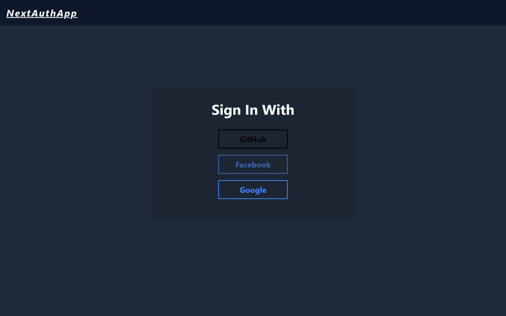

# NextAuthApp
<!-- TABLE OF CONTENTS -->

## Table of Contents

- [Overview](#overview)
  - [Built With](#built-with)
- [Deploy](#deploy)
- [Features](#features)
- [How to use](#how-to-use)


<!-- OVERVIEW -->

## Overview



Log in with different providers provided by the nextauth library and get a token along with the information of the logged in user.

### Built With

- [Nextjs](https://nextjs.org/)
- [Tailwindcss](https://tailwindcss.com/)
- [NextAuth](https://next-auth.js.org/)

## Deploy
[Web site 🚀]()

## Features

- [x] I can login.
- [x] I can login with google, facebook and github.
- [x] I can get a token.
- [x] I can get user info from providers.
- [x] I can refresh the token (only github token).


## How To Use

<!-- Example: -->

To clone and run this application, you'll need [Git](https://git-scm.com) and [Node.js](https://nodejs.org/en/download/) (which comes with [npm](http://npmjs.com)) installed on your computer. From your command line:

```bash
# Clone this repository
$ git clone [repository]

# Install dependencies
$ npm install

# Run the app
$ npm run dev
```

